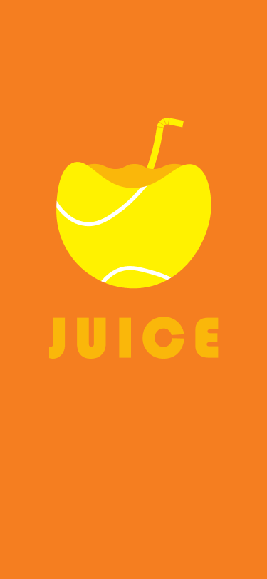
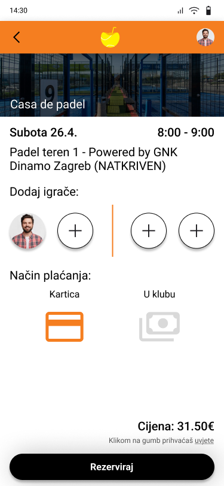
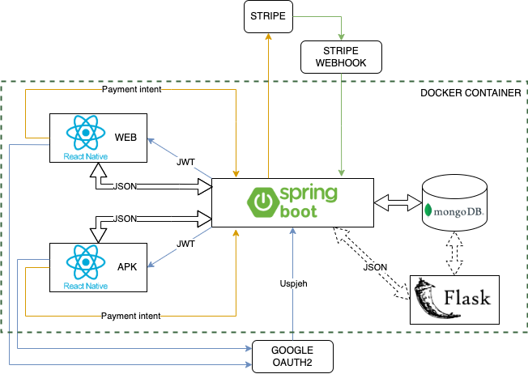
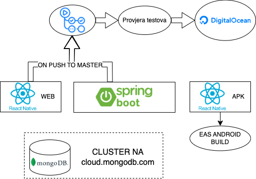

# Juice

Naša aplikacija nudi sveobuhvatno rješenje za organizaciju i sudjelovanje u padel turnirima te rezervaciju objekata, uklanjajući probleme s različitim postojećim rješenjima. Kroz centraliziranu platformu, korisnici će imati sve potrebno na jednom mjestu.

  

Organizacija liga i turnira bit će jednostavna putem naše aplikacije. Korisnici će moći pregledavati nadolazeće turnire, prijavljivati se na njih, pratiti rezultate i povezivati se s drugim sudionicima. Aplikacija će omogućiti filtriranje turnira prema vještinama, datumu i lokaciji, što osigurava bolje iskustvo za sve korisnike, od početnika do profesionalaca.

Korisnicima će biti omogućeno kreiranje vlastitih turnira, bilo za prijatelje, rekreativce ili veće skupine. Kroz jednostavan proces, korisnici mogu postaviti pravila, broj sudionika i datum, te pozvati druge da sudjeluju. Ovaj sustav pruža potpunu slobodu u organiziranju turnira prema vlastitim željama.

Aplikacija također omogućuje jednostavnu rezervaciju objekata za igranje padela. Korisnici mogu pregledavati dostupnost terena u stvarnom vremenu, rezervirati ih za željeni termin i odmah dobiti potvrdu. Svi tereni bit će na jednom mjestu, čime se uklanja potreba za korištenjem više aplikacija ili usluga.

  

Na kraju, aplikacija će omogućiti korisnicima da prate sve svoje turnire i rezervacije putem personaliziranog kalendara. Kalendar će prikazivati nadolazeće događaje, a organizatori će imati pregled prijavljenih sudionika i statusa rezervacija.

Ovim rješenjem, korisnici će imati sve što im je potrebno za uspješno organiziranje i sudjelovanje u padel turnirima te rezervaciju terena, sve na jednoj platformi.

## Korištene tehnologije:
* Java Spring Boot
* React Native
* MongoDB
* Docker
* Figma

  

  

## Aplikacija
- [Mobilna aplikacija](https://drive.google.com/file/d/1Lw_QxpAHWWUsm0N9JlbM4b4zn6rA77X9/view?usp=drive_link)
- [Web verzija](https://juice-frontend-aomia.ondigitalocean.app/)

## Izradili:
* Oliver Živčić
* Zvonimir Škegro
* Leo Stričak

---
Tim Blitz, TVZ Mc2 2025